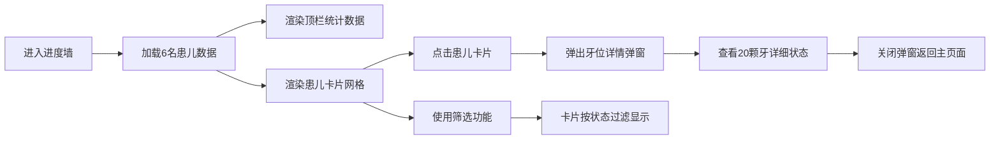

## 1. 产品概述

儿童齿科诊所候诊区「乳牙换牙进度墙」，为小患者和家长提供直观的换牙进度可视化展示，通过游戏化的牙位网格追踪激励小朋友关注口腔健康。

- **主要用途**：候诊区墙面展示、患儿换牙进度追踪、复查提醒
- **目标用户**：齿科诊所医生、护士、儿童患者及家长
- **产品价值**：将换牙过程可视化，提升就诊体验，帮助医生快速了解患儿换牙状态

## 2. 核心功能

### 2.1 功能模块

1. **顶栏统计区**：本日待复查人数、全墙已萌出恒牙总数
2. **患儿卡片列表**：展示6名小患者的基础信息和牙位缩略图
3. **牙位网格展示**：上排/下排各10颗牙的换牙状态可视化
4. **患儿详情弹窗**：点击卡片查看单人口腔全景牙位详情
5. **卡片筛选功能**：按换牙状态筛选患儿卡片

### 2.2 页面详情

| 页面名称 | 模块名称 | 功能描述 |
|-----------|-------------|---------------------|
| 主页面 | 顶栏统计区 | 显示本日待复查人数（含已松动状态）、全墙已萌出恒牙总数，实时更新 |
| 主页面 | 筛选工具栏 | 按换牙状态筛选：全部、已松动、已脱落、恒牙已萌出 |
| 主页面 | 患儿卡片网格 | 6张患儿卡片，每张显示昵称、年龄、20颗牙位缩略图 |
| 详情弹窗 | 牙位详情区 | 大幅展示上排10颗、下排10颗牙齿的详细状态 |
| 详情弹窗 | 状态图例 | 标注4种状态对应的颜色和含义 |

## 3. 核心流程

**用户操作流程**：
1. 用户进入页面，系统自动加载6名种子患儿数据
2. 顶部实时显示待复查人数和已萌出恒牙总数
3. 用户可通过筛选按钮按换牙状态过滤卡片
4. 点击任意患儿卡片，弹出详情窗口展示完整牙位图
5. 已松动牙齿持续闪烁提示复查

## 4. 用户界面设计

### 4.1 设计风格

- **主色调**：医疗蓝 (#4A90D9) 作为主色，代表专业和信任
- **辅助色**：恒牙绿 (#4CAF50)、脱落灰 (#9E9E9E)、松动橙 (#FF9800)、乳牙白 (#FAFAFA)
- **点缀色**：儿童友好的柔和粉色 (#F8BBD0)、淡紫色 (#E1BEE7)
- **字体**：标题使用圆润可爱的 "ZCOOL KuaiLe"，正文使用清晰易读的 "Noto Sans SC"
- **按钮风格**：圆润胶囊形按钮，带有柔和阴影和悬停缩放效果
- **布局风格**：卡片式布局，圆角设计，柔和阴影，温馨活泼的儿童医疗风格
- **图标风格**：使用可爱的牙齿emoji🦷和简洁的线性图标

### 4.2 页面设计概述

| 页面名称 | 模块名称 | UI Elements |
|-----------|-------------|-------------|
| 主页面 | 顶栏统计区 | 渐变蓝色背景，大号数字动画计数，图标+文字并排，左右对称布局 |
| 主页面 | 筛选工具栏 | 圆角胶囊按钮组，选中状态高亮，悬停轻微上浮 |
| 主页面 | 患儿卡片网格 | 响应式3列网格，卡片悬停上浮，牙位小网格嵌在卡片底部 |
| 详情弹窗 | 弹窗容器 | 居中显示，半透明遮罩，圆角白色卡片，缩放进入动画 |
| 详情弹窗 | 牙位详情区 | 上颌弧形排列、下颌弧形排列的牙弓造型，每颗牙齿独立可交互 |
| 详情弹窗 | 状态图例 | 底部横向排列，颜色方块+文字说明 |

### 4.3 动画效果

- **页面加载**：卡片依次淡入上浮，错开0.1s延迟
- **已松动牙齿**：持续脉冲闪烁动画（透明度0.5-1循环）
- **卡片悬停**：上浮4px，阴影加深，缩放1.02倍
- **弹窗开闭**：缩放+淡入淡出动画
- **数字统计**：数字滚动递增动画
- **筛选切换**：卡片平滑淡入淡出过渡

### 4.4 响应式设计

- **桌面端优先**：候诊区大屏展示为主，1920px宽度优化
- **平板适配**：卡片自动调整为2列布局
- **移动端适配**：卡片单列堆叠，顶栏统计垂直排列
- **触摸优化**：增大点击区域，最小44x44px触摸目标
