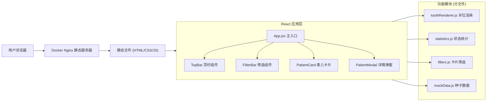
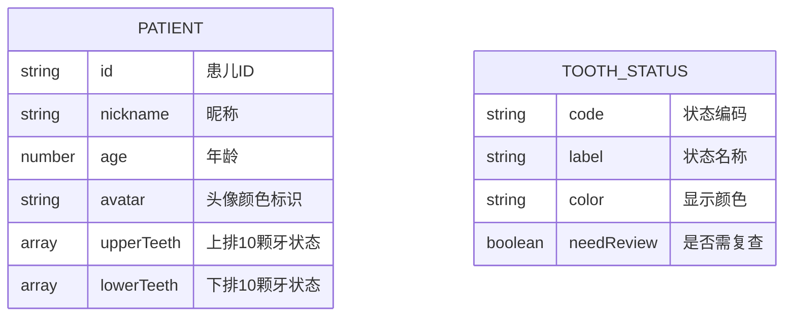

## 1. 架构设计



## 2. 技术描述

- **前端框架**：React@18 + Vite@5
- **样式方案**：TailwindCSS@3 + CSS 动画
- **初始化工具**：npm create vite@latest
- **后端服务**：无（纯前端静态应用）
- **数据方案**：内置 Mock 数据，6名患儿种子数据
- **部署方式**：Docker + Nginx 静态部署

### 2.1 核心技术选型理由

1. **React 18**：组件化开发，便于牙位渲染、统计、筛选等逻辑模块化拆分
2. **Vite**：极速开发体验，生产构建优化，适合纯前端项目
3. **TailwindCSS**：快速构建儿童友好的UI，响应式布局便捷
4. **Docker + Nginx**：标准化静态部署，适合诊所内网环境部署

## 3. 目录结构

```
├── src/
│   ├── components/
│   │   ├── TopBar.jsx          # 顶栏统计组件
│   │   ├── FilterBar.jsx       # 筛选工具栏组件
│   │   ├── PatientCard.jsx     # 患儿卡片组件
│   │   ├── PatientModal.jsx    # 详情弹窗组件
│   │   └── ToothGrid.jsx       # 牙位网格组件
│   ├── modules/
│   │   ├── toothRenderer.js    # 牙位渲染逻辑
│   │   ├── statistics.js       # 状态统计逻辑
│   │   └── filters.js          # 卡片筛选逻辑
│   ├── data/
│   │   └── mockData.js         # 6名患儿种子数据
│   ├── App.jsx                 # 主应用组件
│   ├── main.jsx                # 入口文件
│   └── index.css               # 全局样式
├── public/
├── Dockerfile                  # Docker 部署配置
├── nginx.conf                  # Nginx 配置
├── vite.config.js              # Vite 配置
├── tailwind.config.js          # TailwindCSS 配置
└── package.json
```

## 4. 数据模型

### 4.1 数据模型定义



### 4.2 牙齿状态枚举

| 状态编码 | 状态名称 | 显示颜色 | 是否需复查 |
|---------|---------|---------|-----------|
| NORMAL | 未松动 | #FAFAFA (白色) | 否 |
| LOOSE | 已松动 | #FF9800 (橙色) | 是 |
| FALLEN | 已脱落 | #9E9E9E (灰色) | 否 |
| PERMANENT | 恒牙已萌出 | #4CAF50 (绿色) | 否 |

### 4.3 种子数据结构 (mockData.js)

```javascript
// 6名小患者种子数据
export const mockPatients = [
  {
    id: 'p001',
    nickname: '小明',
    age: 7,
    avatar: '#4A90D9',
    upperTeeth: ['NORMAL','NORMAL','LOOSE','PERMANENT','NORMAL',...], // 10颗
    lowerTeeth: ['PERMANENT','NORMAL','LOOSE','FALLEN','NORMAL',...]  // 10颗
  },
  // ... 共6名患儿
];
```

### 4.4 模块接口定义

**toothRenderer.js - 牙位渲染模块**
- `getToothColor(status)` - 根据状态获取颜色
- `renderToothSVG(status, position)` - 渲染单颗牙齿SVG
- `renderToothGrid(upperTeeth, lowerTeeth, size)` - 渲染完整牙位网格

**statistics.js - 状态统计模块**
- `countToothByStatus(patients, status)` - 统计指定状态牙齿总数
- `countReviewNeeded(patients)` - 统计需复查人数（含已松动）
- `countPermanentTotal(patients)` - 统计全墙已萌出恒牙总数
- `getPatientStatusSummary(patient)` - 获取单患者状态汇总

**filters.js - 卡片筛选模块**
- `filterByStatus(patients, statusFilter)` - 按状态筛选患儿
- `hasToothStatus(patient, status)` - 判断患儿是否有指定状态牙齿
- `getAvailableFilters()` - 获取可用筛选选项列表

## 5. Docker 部署配置

### 5.1 Dockerfile

```dockerfile
# 构建阶段
FROM node:18-alpine AS builder
WORKDIR /app
COPY package*.json ./
RUN npm ci
COPY . .
RUN npm run build

# 运行阶段
FROM nginx:alpine
COPY --from=builder /app/dist /usr/share/nginx/html
COPY nginx.conf /etc/nginx/conf.d/default.conf
EXPOSE 80
CMD ["nginx", "-g", "daemon off;"]
```

### 5.2 nginx.conf

```nginx
server {
    listen 80;
    server_name localhost;
    root /usr/share/nginx/html;
    index index.html;
    
    location / {
        try_files $uri $uri/ /index.html;
    }
    
    location ~* \.(js|css|png|jpg|jpeg|gif|ico|svg)$ {
        expires 1y;
        add_header Cache-Control "public, immutable";
    }
}
```

## 6. 构建与运行

```bash
# 开发环境
npm install
npm run dev

# 生产构建
npm run build

# Docker 构建与运行
docker build -t tooth-progress-wall .
docker run -p 8080:80 tooth-progress-wall
```
